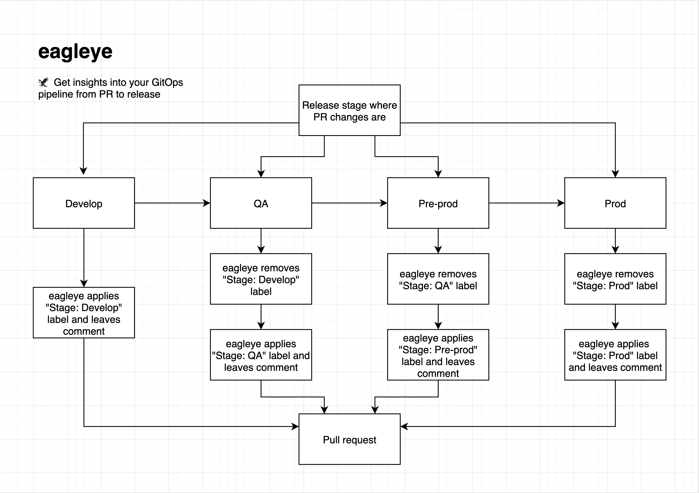

<!-- DO NOT REMOVE - contributor_list:data:start:["Matt-Gleich"]:end -->

# eagleye

🦅 Get insights into your GitOps pipeline from PR to release

## ❓ What is eagleye

eagleye is a bot for VCS platforms such as GitLab or GitHub. Currently we only have support for self-hosted GitLab. It will automatically give labels and leave comments on your pull requests as the helm chart from that PR moves through the GitOps pipeline. Here is a diagram detailing at a high level how this works:

### 💬 Comments

The comment includes the following data:

1. Helm chart file name
2. Timestamp
3. Stage name

## 🤝 Integration

eagleye stores all data in a postgresql database which you can read from freely!

## 🙌 Contributing

Before contributing please read the [CONTRIBUTING.md file](https://github.com/Matt-Gleich/PROJECT_NAME/CONTRIBUTING.md)

<!-- DO NOT REMOVE - contributor_list:start -->

## 👥 Contributors

- **[@Matt-Gleich](https://github.com/Matt-Gleich)**

<!-- DO NOT REMOVE - contributor_list:end -->
